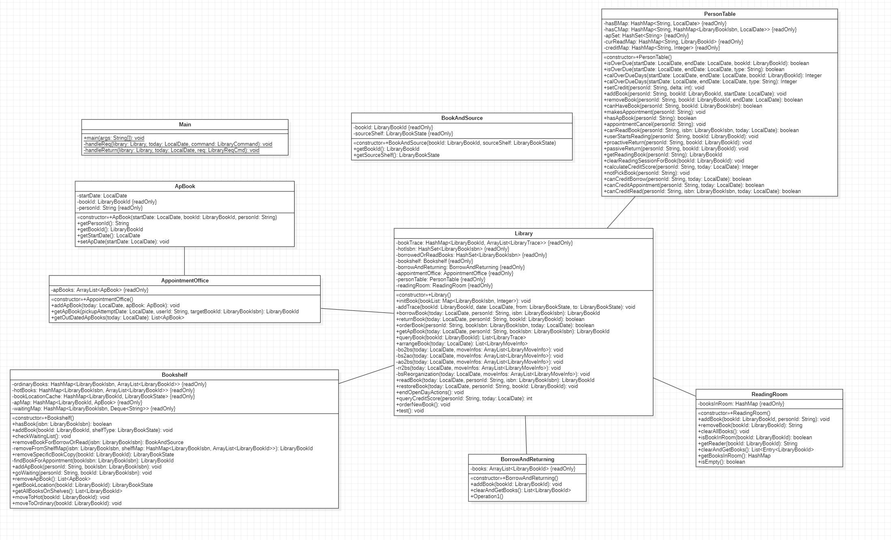

# 正向建模与开发

在第四单元前，我认为JML不过是一种可视化工具，其作用局限于让开发者向用户或产品经理讲解产品的功能，并不能正向的辅助我们进行开发。在写第一次作业的过程中我依然希望直接开始构建代码，而非通过UML引导我进行建模。但第二次作业新增的功能较为复杂，并且我发现，如果没有一个让人直观理解代码运作原理的东西，迭代开发的难度是较大的，因为你每次都需要理清一周前自己写的代码是如何跑起来的。因此，我开始尝试绘制一些不怎么标准的类图，构建起类与类之间的联系，搭起一个大致的框架后再开始具体的代码实现。我发现这样的步骤是非常合理的，构建草图的过程能够将我们从代码实现的繁复中解放出来，从一个宏观的视角对整个项目进行理解。

中国人思考问题总喜欢从宏观到微观，我认为从草图到代码就是这样一个过程，这也是我认为的，正向建模与开发的关系。但是我依然不习惯在敲代码前就绘制标准的UML类图，它太具体了，在绘制的过程中需要思考“每个类有什么属性，有什么方法，方法的参数有哪些，返回值是什么类型的...”等等非常多细碎的问题，想着想着就把人想晕了，个人认为在体感上和直接进行代码实现没有太大差别。

# 本单元架构设计

- `main`：我在`main`中处理所有输入与输出，将命令解析后调用`Library`的相关方法进行处理
- `Library`：处理机制的核心，将请求进行拆分后传递给对应的“部门”进行处理
- 我设计了`Bookshelf, BorrowAndReturning, AppointmentOffice, ReadingRoom, PersonTable`这几个类，用于进行实现具体的业务逻辑
- `ApBook`：主要对`LibraryBookId`类进行了封装，添加了一些关于预约书籍的必要信息
- `BookAndSource`：也是对`LibraryBookId`进行封装，添加了来源书架信息，服务于第二次作业的热门书架功能

最终，我的UML类图与代码实现是完美匹配的~~（因为为了强测不得不完全匹配）~~